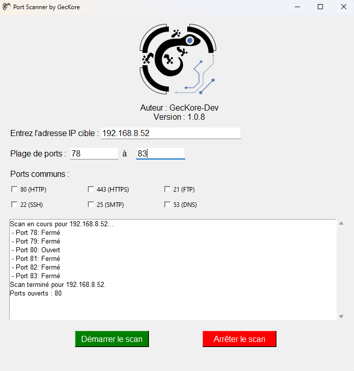

  

# Port Scanner by GecKore

Ce projet est un scanner de ports réseau facile à utiliser et doté d'une interface graphique. Il permet d'explorer l'état des ports d'une adresse IP cible. Vous pouvez choisir des ports communs (HTTP, FTP, etc.) ou définir une plage personnalisée.

## Fonctionnalités :
- **Interface intuitive** : Entrez l'adresse IP et choisissez les ports.
- **Analyse flexible** : Sélectionnez des ports courants ou une plage personnalisée.
- **Barre de défilement** : Naviguez dans les résultats d'analyse.
- **Boutons d'action** : Démarrez ou arrêtez le scan à tout moment.
- **Légal et éthique** : Usage réservé à l'analyse de vos propres réseaux.

⚠️ **Note** : Ce programme est conçu uniquement pour un usage éducatif ou l'analyse de vos propres équipements. Tout autre usage pourrait violer des lois locales ou internationales.

  

